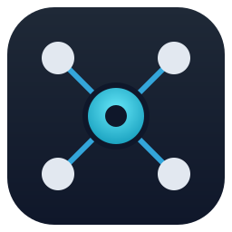
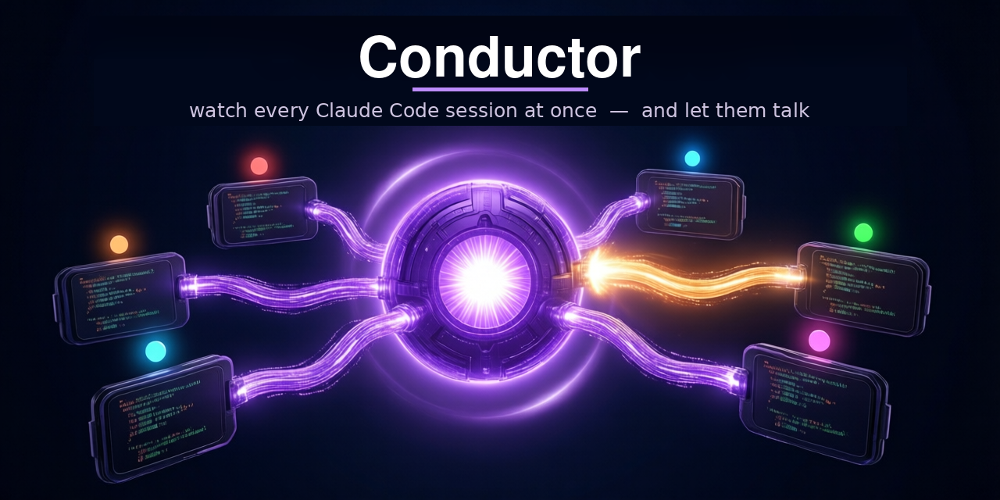
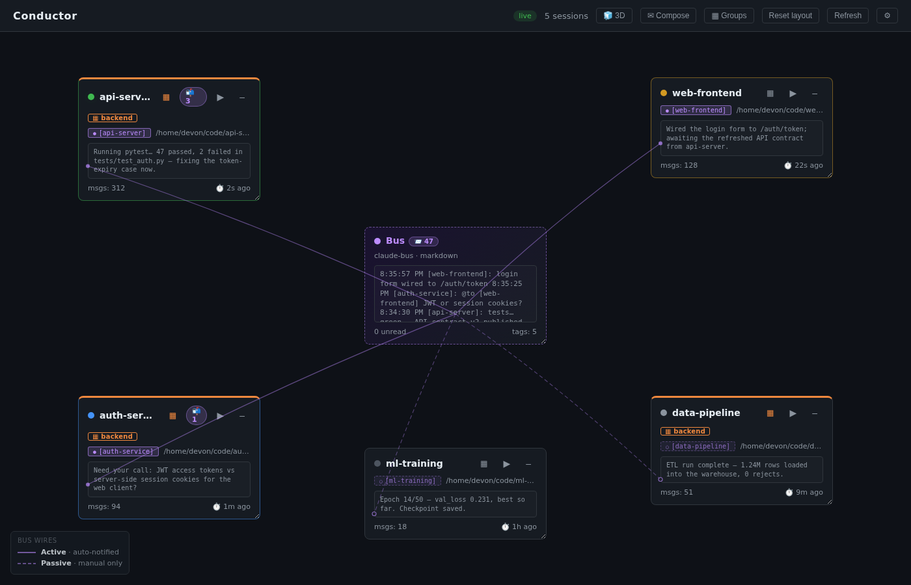
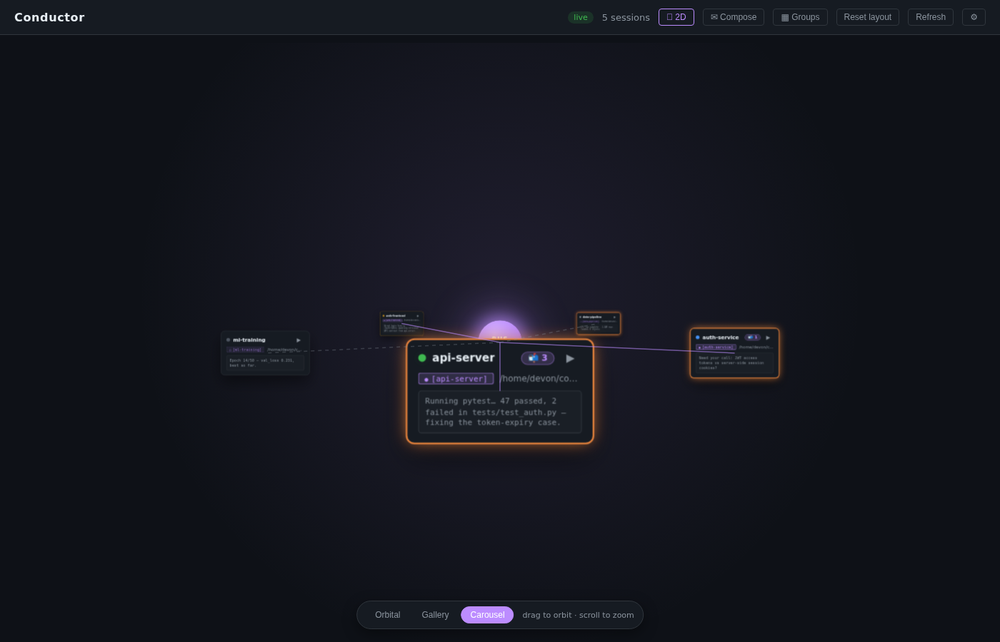
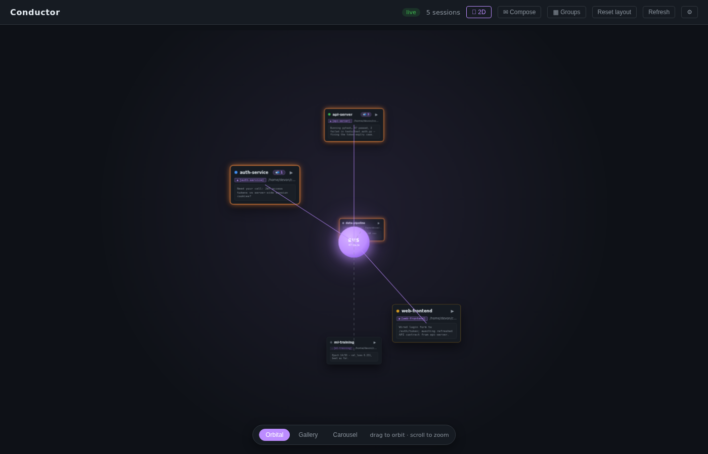
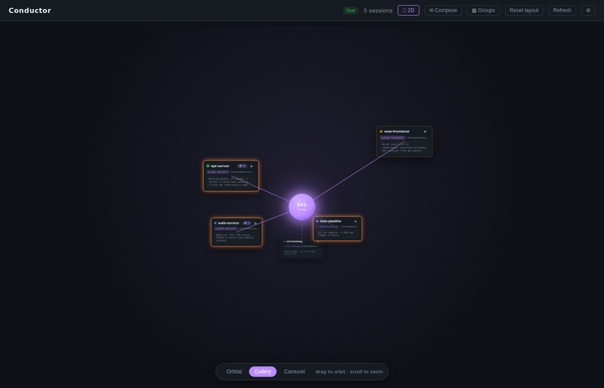
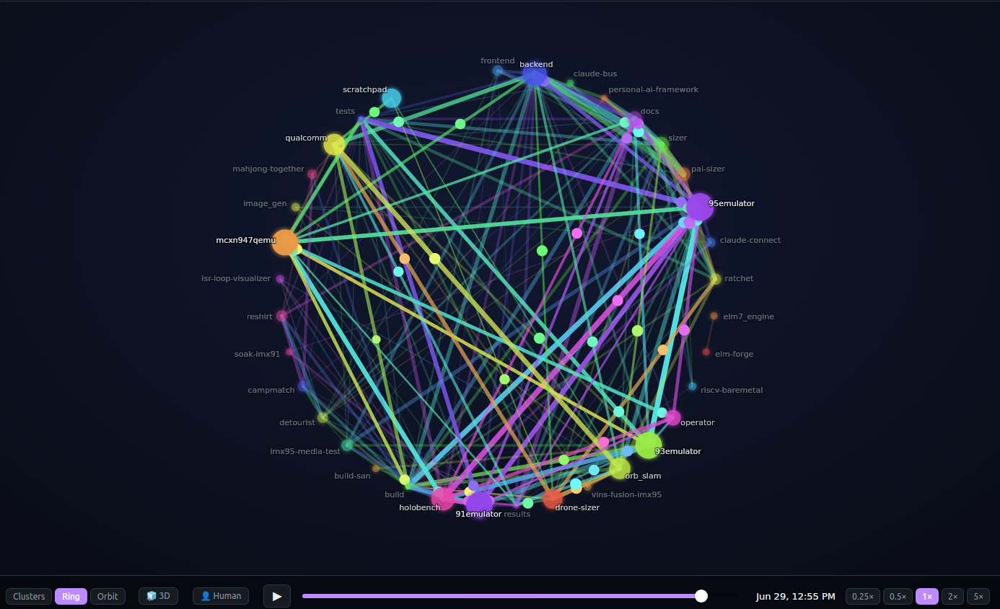

# Claude Connect

**A local dashboard for watching all your Claude Code sessions at once — in your browser or as a standalone desktop app — plus an optional _message bus_ (a shared log your sessions post to) that lets them talk to each other.**

[](https://github.com/kylefoxaustin/claude-connect/releases)
[](#requirements)
[](#how-it-works)
[](LICENSE)

<p align="center">
  
</p>

```
┌─ ●  api-server ────────────────┐  ┌─ ●  web-app ───────────────────┐
│ ~/code/api                 📬3 │  │ ~/code/web                     │
│ ┌──────────────────────────┐   │  │ ┌──────────────────────────┐   │
│ │ ...running test suite    │   │  │ │ ...waiting on user input │   │
│ └──────────────────────────┘   │  │ └──────────────────────────┘   │
│  msgs: 47   ⏱ 2s ago           │  │  msgs: 12   ⏱ 1m ago           │
└────────────────────────────────┘  └────────────────────────────────┘
```

> 💡 **Heads up on names:** the repo is `claude-connect`; the app (and its Python package) is `conductor`. Same project — you'll see both names throughout.

## Why?

If you're like us, you're running 3, 4, or 8 Claude Code sessions at once across different projects. You forget which terminal is doing what. You miss when one finishes and goes quiet. You wish they could *coordinate* — "hey, the API change is in, you can start on the frontend."

**Claude Connect solves both problems:**

- **See everything at a glance.** One tile per live Claude session — status dot, live preview of what it's saying, time since last activity. Click a tile to jump to that terminal.
- **Let your Claudes talk.** Wire up the optional message bus and your sessions can `/msg-send` each other across projects. The dashboard shows the traffic with animated connection lines.

It's **local, and read-only toward Claude**. It watches Claude's `~/.claude/projects/*.jsonl` logs and process state — it never edits your files or conversations, and it binds only to `127.0.0.1`. **Nothing leaves your machine** — no telemetry, no uploads; the only outbound request is an optional Three.js CDN fetch, and only if you open the 3D view. The few *actions* it can take are **external and user-triggered**: raise a terminal window, type `/msg-check` into a session, append to the separate bus log, or relaunch a closed session — never a silent write to Claude's own state.

---

## What it looks like



<sub>The classic 2D board: live tiles, status dots, the orange **backend** group, the central **Bus** tile, and connection wires (solid = active, dashed = passive). *Sample data shown.*</sub>

### …or flip to 3D

New in **2.2**: a **🧊 3D** button swaps the board into a WebGL scene where your sessions float around a glowing bus core, grouped sessions cluster together, and you orbit/zoom the whole thing. Three layouts — pick by feel:

| Carousel *(default)* | Orbital | Gallery |
| :---: | :---: | :---: |
|  |  |  |
| Spin through sessions; the front card is focused and fully readable. | Sessions orbit the bus core on a sphere; groups share an arc. | Your saved 2D positions, lifted into depth; groups clump together. |

<sub>Cards always face the camera, so text stays readable at any angle. 2D stays the default — 3D is one click away. *Sample data shown.*</sub>

### …or replay the whole story

New in **2.3–2.5**: a **🕸 History** button replays your entire cross-session history as an animated, scrubbable graph — sessions light up as they first speak, mention-lines thicken with traffic, and a live force layout drifts frequent collaborators together. Toggle **👤 Human turns** to weave in *your* prompts and each Claude's replies (a node for **you** at the hub), then **🔬 click a session** to watch its whole working relationship with you replay — each prompt fires in and the session *explodes outward* into the files it touched, the commands it ran, and the sub-agents it spawned.

**New in 2.8: 🧊 rotate the graph in 3D.** Drag to orbit the whole web (it idles with a gentle spin) — the *Ring* tilts and spins, *Orbit* lifts into a dome, *Clusters* spreads into a 3D cloud — so you can read a tangle of links from any angle. Still pure SVG (a hand-rolled projection, no WebGL).



<sub>The Ring layout tilted in **🧊 3D**: each dot is a session, each line a mention, thickness = how often that pair talks. Real cross-session traffic — node names only, no message content.</sub>

```
   you ──prompt──▶ ( 95emulator ) ──▶ ◍ ◍ ◍ files (read/edited)
        ──prompt──▶              ──▶ ⚙ Explore  ⚙ Plan   (agents)
                                 ──▶ Bash ×119 · Grep ×4  (tools)
   scrub the whole relationship · 0.25×–5× · 🔍 focus one exchange
```

<sub>Pure SVG, lazily loaded, read-only — it just visualizes the bus log + transcripts you already have. Works even without the message bus. (`95emulator`, `Explore`, etc. are just sample session/agent names.)</sub>

---

## Features

- 🪟 **Live tiles** for every running Claude session — auto-discovered, no config
- 🎯 **Click-to-focus** — clicking a tile raises the actual terminal window
- 📬 **Cross-session messaging** with an animated bus tile showing live traffic
- 🎛️ **Shared-GPU reservation** *(new in 2.9)* — sessions self-coordinate one GPU over the bus: `/gpu-reserve <dur> <soft|hard>`, `/gpu-status`, `/gpu-release`. Each session sees who holds it in its own context (no asking); **soft** holds yield on request, **hard** holds run to completion; leases auto-expire so nothing gets stuck
- ✉️ **Compose from the dashboard** — send your own bus message to all sessions or a chosen few, with an optional "ping" that makes them read it now
- 🟢 **Status indicators** — `active` / `warm` / `idle` / `dormant` / `waiting` / `ended`
- 💾 **Persistent layout** — drag tiles to rearrange and **resize** them (corner grip); both stick
- 🗕 **Minimize to dock** — tuck rarely-touched sessions into a bottom dock (still live), restore with a click
- 💤 **Dormant dock — relaunch a closed session** *(new in 2.6)* — sessions you've closed don't disappear; they wait as chips in a **💤 Dormant** shelf. **Click one to relaunch it** — reopens `claude --continue` in its original folder, a clean resume in a single click (✕ to dismiss). Optional opt-ins can also auto-run `/rc` (Claude Code's `/remote-control`) or `/rename` afterwards
- ▦ **Groups** — color-code sessions into named groups; minimize a whole group to one dock chip with a rollup badge
- 🖥️ **Install as a desktop app** *(new in 2.7)* — `make install-app` stages a self-contained install into `~/.local/share/conductor/` with an app-menu launcher, so it runs like a normal installed app and the cloned repo becomes disposable
- 🧊 **3D view** *(new in 2.2)* — flip the whole board into a WebGL scene (Carousel / Orbital / Gallery); grouped sessions cluster in space, cards stay readable, 2D remains the default
- 🕸 **History time-lapse** *(new in 2.3)* — replay your **entire** bus history (live log + every archive) as an animated graph: sessions appear as they first speak, mention-lines thicken with traffic, pulse size shows each message's length, and a live **force layout** drifts frequent partners together. Play/pause, scrub, 0.25×–5× speeds. **2.4** adds a **👤 Human turns** layer — weave in *your* prompts + each Claude's replies (read from the transcripts) onto the same timeline, with a node for **you** at the hub. **2.5** adds a **🔬 drill-down** — click a session and watch its *whole working relationship with you* replay: each prompt fires in, and the session **explodes outward** into the files it touched, the commands it ran, and the sub-agents it spawned (or focus a single exchange at a time)
- 🔀 **Active/Passive bus control** — click a tile's tag chip to toggle whether it's auto-notified of bus traffic
- 🎨 **Themeable** — dark/light, animations, connection-line styling
- 🔒 **Local only** — `127.0.0.1`, in-memory, restart-clean

---

## Requirements

- **Linux with X11** (Wayland is best-effort)
- **Python 3.10+**
- **`wmctrl` and `xdotool`** for terminal focus and `/msg-check` injection
  - Both optional — without them, the focus and 📬 buttons just no-op
  - **[Tilix](https://gnunn1.github.io/tilix-web/) users** (Tilix is a tiling terminal emulator) also get exact-tile focus via `gdbus` (ships with GLib, already present on any GTK desktop) — see [Reliable Terminal Focus](#reliable-terminal-focus)
- **Native App Edition only:** system WebKitGTK (`python3-gi`, `gir1.2-webkit2-4.0`, `libwebkit2gtk-4.0-37`) — see [Native App Edition](#native-app-edition-ubuntu). The Web Browser Edition needs none of this.

---

## Quick Start

```bash
# 1. Clone and install
git clone https://github.com/kylefoxaustin/claude-connect
cd claude-connect
pip install -e ".[dev]"

# 2. Install the OS helpers (recommended)
sudo apt install wmctrl xdotool

# 3. Copy the example settings
cp settings.example.toml settings.toml

# 4. Run it
make dev    # http://127.0.0.1:8765, auto-reload
```

Open the URL in a browser. Start a Claude Code session in another terminal — a tile appears within seconds. **No per-session registration. No config to get started.**

Other targets:

```bash
make run     # production-style, no reload
make test    # run the pytest suite
```

---

## Editions

Conductor ships in two editions from the same codebase:

| Edition | What it is | Run |
|---|---|---|
| **Web Browser** | The dashboard served at `http://127.0.0.1:8765`, opened in any browser. | `make dev` / `make run` |
| **Native App** | The *same* dashboard wrapped in a native desktop window (pywebview → WebKitGTK), with its own app-menu launcher and dock icon. | `make native` |

Both editions ship in a **single release per version** (`vX.Y.Z`) — it's one
codebase at one commit, the edition is just how you run it. New features land
once and both editions get them.

### Native App Edition (Ubuntu)

The native edition runs the identical FastAPI + JS app inside a WebKitGTK window.
The uvicorn server runs in a background thread; **closing the window stops the
server** (nothing is left running). If a Conductor is already serving the port
(e.g. a `make dev` instance, or a second launch), the app *attaches* to it
instead of starting a duplicate.

```bash
# 1. System WebKitGTK (not pip-installable — provides PyGObject + the WebKit2 typelib)
sudo apt install python3-gi gir1.2-webkit2-4.0 libwebkit2gtk-4.0-37

# 2. Build the native venv (--system-site-packages, so it can see system gi/WebKit) + pywebview
make install-native

# 3. Launch the native window
make native

# 4. (Optional) Add a launcher to your app menu / dock, with this checkout's paths baked in
make install-desktop
```

`make install-native` creates a **separate** `.venv-native` so the Web edition's
`.venv` stays untouched. `make install-desktop` writes
`~/.local/share/applications/conductor.desktop` (icon: `assets/conductor.svg`,
`StartupWMClass=conductor` for dock grouping) — re-run it if you move the repo.

> Tested against WebKit2 **4.0** (Ubuntu 22.04). The SVG connection-line overlays
> and tile drag render correctly under WebKitGTK.

#### Two ways to “install” it

`make native` and `make install-desktop` both run the app **out of this cloned
repo** — keep the clone around. If you'd rather treat Conductor like a normal
installed app you can delete the clone afterward, use the staged install:

| Goal | Command | Where the code lives |
|---|---|---|
| Run from the clone (dev) | `make native` | this repo (foreground; closing the terminal stops it) |
| App-menu launcher, code in the clone | `make install-desktop` | this repo (don't delete it) |
| **Installed app, clone disposable** | **`make install-app`** | `~/.local/share/conductor/` (clone can be deleted) |

```bash
# One-time, self-contained install (after the apt deps above):
make install-app      # copies the app + builds its venv into ~/.local/share/conductor,
                      # then adds the app-menu launcher pointing there
# → launch "Conductor" from your app menu / dock; it runs detached (no terminal).
# → the cloned repo is now disposable. Re-run to update; `make uninstall-app` to remove.
```

`make install-app` stages the app (code, served frontend, icon, and the
`claude-tracked` relaunch helper) into `~/.local/share/conductor/`, builds the
WebKitGTK venv **there**, and points the `.desktop` launcher at that copy — so it
keeps full host access (it still spawns terminals, focuses windows, and reads
`~/.claude`) and survives deleting the clone. It is **not** a sandboxed package
(Flatpak/Snap would hide the host's processes from `psutil` and break session
discovery) nor a single-file binary — it's a self-contained local install that
behaves like an installed app.

---

## Using the Dashboard

### Tiles

Each tile is one live Claude session. It shows:

- **Status dot** — `active` (writing now), `warm` (recent), `idle`, `dormant`, `waiting` (on user input), `ended`
- **Squashed live preview** of the latest message
- **Message count + time since last activity**
- **📬 bubble** — appears when this session has unread bus messages (only if the [bus](#cross-session-bus) is wired up)
- **Tag chip** (e.g. `[backend]`) — its bus identity, and a click-toggle for [Active/Passive](#active--passive) membership

**Drag** a tile to move it; **drag the bottom-right corner** to resize it; the **`–`** button minimizes it to the bottom dock. Hover a truncated title to see it in full. Position, size, and minimized state persist across restarts.

### Minimize / dock

Click a tile's **`–`** to tuck it into a thin **dock** along the bottom — a tiny chip with its status dot, name, and 📬 badge. It's still monitored (the dot keeps updating; a new message still lights the badge), just out of the way. Hover for the full name; **click the chip to restore** it to its previous position and size. Minimized tiles' bus wires are hidden to keep the board clean.

### 💤 Dormant dock

Closing a Claude session doesn't erase it from the board. Any project folder Conductor has seen — one with transcript history but **no live process right now** — waits as a chip in a **💤 Dormant** group at the end of the bottom dock. Think of it as the *recently-closed-sessions shelf*: the work you'll come back to. *(Distinct from the `dormant` **status dot**, which marks a session that's still running but has been quiet a while — the shelf is for sessions that have fully closed.)*

```
 ─ minimized ─┊─ 💤 DORMANT ──────────────────────────────────────────
   ● web-app  ┊  💤 orb_slam  [other:orb_slam] ✕   💤 reshirt  ✕   …
              ┊      └─ click ▸ claude --continue in its folder
```

**Click a dormant chip to relaunch that session.** Conductor opens **`claude --continue` in the session's original folder** (in a tracked terminal window) — a clean resume that picks up right where you left off. The chip shows "launching…", then disappears as the now-live session takes its place as a normal tile.

- **Auto-discovered** — no list to maintain. It's every folder with history that isn't currently live (a session already running there is never offered), capped at the 40 most-recently-active. The **✕** on a chip dismisses it; a dismissed folder reappears on its own the next time you actually run a session there.
- **Resumes, doesn't restart.** `claude --continue` picks up that folder's most recent conversation, so you land back where you left off — not a blank session.
- **Optional keystrokes after relaunch** (both **off by default**, in the `[relaunch]` block of `settings.toml`): `rc` auto-runs **`/rc`** — Claude Code's `/remote-control`, which makes the resumed session drivable from a browser/phone (needs a qualifying plan + `/login`); `rename` re-issues `/rename` (usually unneeded — `--continue` keeps the prior name). With both off, relaunch types nothing. Timing knobs: `settle_seconds` (wait for the TUI before typing), `appear_timeout_seconds`, `between_seconds`.

> When `rc`/`rename` are enabled, keystroke injection is **best on tilix** (like [click-to-focus](#reliable-terminal-focus)) and needs `xdotool` — it briefly **steals focus** while typing. Relaunch itself (the spawn) works anywhere: it goes through `scripts/claude-tracked` — found on your `PATH` or used straight from the repo — which uses `tilix -e` so the command runs even when a tilix server is already open.

### Groups

For a crowded board, organize sessions into **named, color-coded groups**. Each tile has a **▦** button that opens a small menu:

- **▦ → New group from this** (prompts for a name) — or **Add to ▸ {group}** to join an existing one. A tile belongs to one group; members get a colored top accent.
- On a grouped tile: **Rename group**, **Move to ▸ {other}**, **Remove from group**, or **Minimize group** — which folds the *whole* group into a single dock chip (swatch + name + member count + active dot + total 📬). Click the chip to expand it back.
- The **▦ Groups** panel (top bar) lists every group to rename, recolor, minimize/restore, or ungroup.

Groups are *logical* (members keep their own positions — they aren't auto-arranged) and persist across restarts.

### 🧊 3D view

Click **🧊 3D** in the top bar to lift the board into a 3D scene; click **🗔 2D** to come back. **2D is the default** and stays untouched — 3D is an optional view, and your choice (plus the last layout) is remembered.

- **Navigate** — *drag* to orbit the camera, *scroll* to zoom. Click a card's **▶** to focus its terminal, or its tag chip to toggle Active/Passive, just like 2D.
- **Cards always face you.** No matter how you orbit, every card is billboarded toward the camera so the text stays readable — depth and motion live in the *space between* sessions, never in the angle of the content.
- **Groups become places.** Cards carry their group color (border + glow), and group members physically **cluster together** in the scene. The glowing **bus core** sits at the center with wires fanning out (solid = active, dashed = passive), pulsing on each message.
- **Three layouts** (switcher floats at the bottom):
  - **Carousel** *(default)* — sessions on a ring you spin through; the front card is enlarged and in focus.
  - **Orbital** — sessions orbit the bus core on a sphere; each group shares an arc.
  - **Gallery** — your saved 2D positions lifted into depth (active sessions float forward, idle recede), with groups pulled into tight clumps.

> The 3D view loads Three.js from a CDN the first time you open it (no build step). Offline or CDN blocked? It cleanly falls back to 2D with a notice — the 2D board never depends on it. Assign/rename/recolor groups from the 2D **▦** menu; 3D visualizes whatever's set.

### 🕸 History (time-lapse)

Click **🕸 History** in the top bar to replay your whole cross-session bus as an animated graph — *who talked to whom, and when*. It sweeps the live log **and every monthly archive**, so it's the full story, not just what's on screen now.

- **Sessions are nodes** that fade in the moment each one first speaks, and stay (dimmed) once they go quiet — so you watch the network *populate* over weeks.
- **Lines are mentions.** The bus is broadcast-only, so an edge means *one session named another* in its message — the real "who's addressing whom" signal. Line thickness = how *often* that pair talks; a **pulse-dot** flies the wire on each message, sized by the message's **length** (a fat packet for a multi-KB status report, a speck for a quick "hi").
- **Three layouts** (switcher at the bottom-left):
  - **Clusters** *(default)* — a live force layout. Mention-edges act like springs, so **frequent partners drift together** and clusters tighten as traffic accumulates during playback.
  - **Ring** — every session on a circle in arrival order; stable and fully labeled.
  - **Orbit** — radial by volume: the loudest sessions pulled to the center, quiet ones on the rim.
- **👤 Human turns** *(2.4)* — toggle this to weave in the **human↔Claude** layer: a **you** node (labeled with your username) plus *your* prompts and each session's replies, read turn-by-turn from the `~/.claude/projects` transcripts and merged onto the same timeline. Human edges are **gold/dashed** to set them apart from the inter-Claude mention lines, so you can watch a day of work flow — *a prompt fires to a session, it posts to the bus, another replies*. In **Clusters** layout the sessions you talk to most drift in toward you. (Turn-level: each exchange is one prompt + one reply, not every streaming chunk. Only *genuine* typed prompts count — harness injections like system-reminders, slash-commands, and auto-compact summaries are filtered out.)
- **🔬 Drill-down** *(2.5)* — with Human turns on, **click a session node** and watch the whole **you↔session working relationship** replay: a **you** node fires each of your prompts into the central session node, which **explodes outward** into the work it did — the **files** it touched (a deduped halo, read = blue / edited = orange, growing with each touch), the **sub-agents** it spawned (Agent/Task, labeled by type), and every **tool call** firing a pulse + ticking a live counter (`Bash ×N · Grep ×N · …`). `tool_result` failures tint red. Hit **🔍 Focus prompt** to isolate a single exchange at a time (the `● focused ✕` chip returns you to the whole relationship). Its own play/scrub/speed controls; **← Back** to the timeline.
- **🧊 3D** *(2.8)* — toggle to **rotate the whole graph in space**: drag to orbit, and it idles with a gentle spin. Each layout gains real depth — **ring** tilts and spins, **orbit** lifts into a **dome** (loud sessions centered/high), **clusters** spreads into a 3D cloud — so you can see a tangle of links from any angle. Still pure SVG (a hand-rolled projection, no WebGL); 2D stays the default.
- **Drive it** — play/pause, drag the **scrubber** anywhere, and pick a speed (**0.25× / 0.5× / 1× / 2× / 5×**). A live clock shows the date as history unspools.

> Pure SVG, no dependencies — `heatmap.js` (and `drilldown.js`) are lazily loaded on first open, so (like 3D) they can never affect the 2D board. Read-only: it just visualizes the bus log + transcripts you already have. The human layer reads the same `*.jsonl` Conductor already tails for live previews; older turns past a cap are trimmed (the count is shown, never silently dropped).

### Click a tile

Raises that session's terminal window. See [Reliable terminal focus](#reliable-terminal-focus) for the trick that makes this work cleanly when you have many sessions in one terminal app.

### Click the 📬 bubble

Runs `/msg-check` *inside that live Claude* — it raises the window and types the command for you. Behavior is configurable so you don't clobber a Claude mid-task (see below).

### Bus tile

A central tile shows recent cross-session traffic. SVG lines fan out to every session that's on the bus and animate on each message. The line style tells you *how* a session is on the bus (see the legend, bottom-left):

- **Active** (solid) — wired to the bus hooks, so it's **auto-notified** of new messages and receives broadcasts.
- **Passive** (dashed, dim) — has used the bus manually (`/msg-send` / `/msg-check`) but isn't auto-notified, so it **won't see broadcasts** unless you Ping it. (These are sessions outside `bus.sh`'s hook whitelist — a deliberate scoping so the bus doesn't pester unrelated sessions.)

### Active / Passive

Click a tile's **tag chip** to toggle that session between **Active** (auto-notified) and **Passive** (manual only) right from the dashboard. Conductor writes the membership to `~/.claude/bus-state/active-tags`, and `bus.sh` reads it — so the change takes effect on that session's **next prompt** (promote a throwaway session into the team, or stop pestering one). The list seeds from your existing active set on first toggle, so nothing changes until you click.

> Requires the data-file-aware `bus.sh` (the shipped [`bus/bus.sh`](bus/bus.sh) reads `active-tags`, falling back to its built-in `BUS_WHITELIST` when the file is absent). If you wired up the bus before this, re-copy `bus/bus.sh`.

### ✉ Compose

Click **Compose** in the top bar to send your own message on the bus — like email for your sessions. You're a first-class sender (tagged `[operator]` by default; set `bus.sender_tag` in `settings.toml` to your name).

- **All sessions** (default) — a broadcast everyone sees.
- **Specific sessions** — uncheck "All" and pick recipients. The message is soft-addressed with a leading `@to [tag] …` line, so receivers (and the dashboard's connection-line animation) know who it's for. It's still on the shared log; addressing is advisory, not private.
- **Ping recipients** — also injects `/msg-check` into the chosen sessions so they read it immediately (specific recipients only — broadcast-ping would steal focus across every window). `Ctrl/⌘+Enter` sends.

> Sending makes Claude Connect a *writer* on the bus (it still never touches Claude's own state). Requires the markdown bus adapter.

### ⚙ Settings

Theme, connection lines (incl. **Lines behind tiles** to drop the wires behind the tiles for a cleaner board — each wire still stays anchored to its own tile via a plug + stub drawn on top), animations, rescan cadence, and the **bus-bubble click policy**:

| Policy                                      | Behavior                                                                                      |
| ------------------------------------------- | --------------------------------------------------------------------------------------------- |
| **Confirm if busy, inject if idle** *(default)* | Inject silently when idle; confirm first if the session looks busy (writing in the last 30s). |
| **Always inject**                           | Type `/msg-check` immediately, regardless of state.                                           |
| **Block while busy**                        | Badge is dimmed/non-clickable while busy; injects only when idle.                             |
| **Always confirm**                          | Ask before every injection.                                                                   |

> ⚠️ "Busy" is inferred from `jsonl` activity + CPU. A Claude blocked on a long, quiet tool call can still look idle, so this guard *shrinks* the risk of clobbering rather than eliminating it. Use *Always confirm* if you want a prompt every time.

---

## Cross-Session Bus

> *Optional, but the killer feature.*

The 📬 features ride on a **shared markdown message log**. Claude sessions append to it with `/msg-send` and read it with `/msg-check`; hooks make each session aware of new messages. Claude Connect tails the same log to drive the bus tile.

### Setup

```bash
install -Dm755 bus/bus.sh ~/.claude/bin/bus.sh
cp bus/commands/*.md ~/.claude/commands/

# Then merge bus/settings.hooks.example.json into ~/.claude/settings.json
```

Point Claude Connect at the log in the `[bus]` section of `settings.toml`. Full setup docs and format spec:

- 📖 [`bus/README.md`](bus/README.md) — install + slash commands + the **🎛️ GPU reservation** system
- 📖 [`docs/claude-bus.md`](docs/claude-bus.md) — message format spec

Beyond messaging, the bus can also **arbitrate a shared GPU** so sessions
self-coordinate access (reserve/release with soft/hard holds, auto-expiry, and
per-prompt awareness of who holds it) — see the [GPU reservation](bus/README.md#gpu-reservation-shared-resource-coordination) docs.

### What if a session isn't on the bus?

Claude Connect works fully without it. Session discovery comes from OS process state, not from the bus, so:

- ✅ An un-wired Claude still appears as a normal tile — status, preview, message count, click-to-focus all work
- ❌ It just won't show a 📬 badge or a connection line to the Bus tile

This is actually useful — if you wire up some sessions and leave others out, the dashboard shows at a glance which ones are on the bus and which are silent.

---

## Reliable Terminal Focus

A single terminal server (Tilix, `gnome-terminal-server`) owns all its windows, so they share one PID — and a tiled window shows only the *active* tile's title at a time. So matching purely on **window title** is ambiguous: a backgrounded tile has no title of its own on the window, and a stray same-named terminal (e.g. a shell `cd`'d into the project dir) can win the match.

**Tilix gets an exact path.** Each tilix tile stamps its shell with a `TILIX_ID` env var, so Claude Connect reads that UUID from the Claude process and tells tilix (over its `com.gexperts.Tilix` D-Bus interface) to focus that precise tile — **raising the window *and* switching to the exact tile**, even inside a combined/tiled window where several Claudes share one window. No wrapper, no setup; it just works if you run Claude inside tilix.

> Scope: this exact-tile path is **tilix-only** and only tested on tilix. Other terminals fall through to the title-matching path below — no regression, just less precise.

For non-tilix terminals, focus falls back to **window-title matching**, and the optional `claude-tracked` wrapper in [`scripts/`](scripts/) gives each Claude its own window with a unique X11 title so focus and 📬 injection target precisely:

```bash
sudo install -m755 scripts/claude-tracked /usr/local/bin/
claude-tracked api-server --resume
```

Without either the tilix path or the wrapper, focus is best-effort: Claude Connect raises the terminal window owning the Claude PID, but can't switch between tabs packed into one window.

---

## Configuration

Edit `settings.toml` (copied from `settings.example.toml`). Key knobs:

| Setting                       | What it does                                                  | Default |
| ----------------------------- | ------------------------------------------------------------- | ------- |
| `scanner.interval_seconds`    | Full rescan cadence                                           | `3`     |
| `bus.adapter`                 | `markdown` (the reference bus), `jsonl` (generic), or `fake`  | —       |
| `bus.markdown_path`           | Path to the bus log                                           | `~/Documents/claude-bus/messages.md` |
| `bus.state_dir`               | Where unread state lives                                      | —       |
| `bus.script_path`             | Path to `bus.sh`                                              | —       |
| `bus.sender_tag`              | Your tag when you **Compose** a message (e.g. your name)      | `operator` |
| `[bus.tags]`                  | Map a project dir → bus tag, mirroring your `bus.sh` (labels tiles **and** keys the 🕸 History human layer to the right node) | — |
| `ui.end_fadeout_seconds`      | How long ended-session tiles linger after exit                | `30`    |
| `[relaunch]`                  | 💤 Dormant-dock relaunch (all opt-in): `rc` (auto-run `/rc` remote-control), `rename` (auto-`/rename`), `settle_seconds` (wait before typing), `appear_timeout_seconds`, `between_seconds` | `false` / `2.5` |

---

## What's stored, and where

Conductor keeps **no central database** — state lives in two clearly separated places:

**Your browser (localStorage, per-origin `127.0.0.1:8765`)** — all the visual/layout customization. Written to disk by the browser, so it survives closing the tab, restarting the browser, restarting the server, and rebooting:

| Key | Holds |
| --- | --- |
| `conductor.prefs.v1` | theme, connection-line visibility, lines-behind, flow animation, bus-bubble click policy |
| `conductor.positions.v2` | tile positions **and sizes** |
| `conductor.minimized.v2` | which tiles are minimized to the dock |
| `conductor.parkedDismissed.v1` | dormant-dock chips you've dismissed (auto-cleared when that folder runs live again) |
| `conductor.groups.v2` | your groups (names, colors, members, collapsed state) |
| `conductor.heatmapLayout` | 🕸 History layout (clusters / ring / orbit) |
| `conductor.heatmapHuman` | 🕸 History — whether the 👤 Human layer is on |

Layout/minimize/group state is keyed by **project directory**, so a session re-attaches to its saved spot, size, and group whenever it runs in the same directory — across reboots and even fresh (non-resumed) sessions. Conductor doesn't prune offline tiles' layout, so it waits for them to return. Clear it with **Reset layout**, **Ungroup**, or your browser's site-data tools.

**On your machine (the bus), not the browser:** the cross-session bus log (`~/Documents/claude-bus/messages.md`), unread state (`~/.claude/bus-state/`), and the active/passive whitelist (`~/.claude/bus-state/active-tags`). The Conductor server itself is **in-memory and restart-clean** — it holds no persistent state of its own.

---

## How It Works

For the curious:

1. **SessionScanner** enumerates Claude Code processes via `psutil`, resolves `/proc/<pid>/cwd`, and walks `~/.claude/projects/<encoded>/` to find each session's `*.jsonl`.
2. **ActivityWatcher** uses `watchdog` (inotify on Linux) to react to jsonl writes without polling.
3. A **WebSocket hub** at `/ws` fans updates out to the browser: a full session + bus snapshot every `scanner.interval_seconds` (3 s by default), plus an immediate per-session push whenever a jsonl write fires (inotify), and a bus event as each message arrives.
4. The **frontend** renders one tile per session — plain JS, no build step.
5. **BusAdapter** tails the message-bus log; the Bus tile shows recent traffic and SVG lines fan out to sessions on the bus.
6. **WindowMapper** raises the right terminal window on click and types `/msg-check` into a session when you click its 📬 — focusing the exact tilix tile via `gdbus` + `TILIX_ID` when available, else falling back to `wmctrl`/`xdotool` title matching.
7. **Relaunch** (💤 dormant dock) discovers closed-but-known folders (`discover_parked_projects` — history on disk, no live process), and `POST /api/relaunch` spawns `claude --continue` there via `claude-tracked`, then polls the scanner for the new session and types `/rc` into it once its terminal is up.
8. **🕸 History** is served on demand: `GET /api/bus/heatmap` parses the bus log + archives into a time-ordered mention graph; `?human=1` merges in turn-level prompt/reply events from the transcripts; `GET /api/exchange` extracts one prompt's tool/file/agent fan-out for the 🔬 drill-down. All read-only, parsed off-thread.

Full design doc: [`CONDUCTOR_SPEC.md`](CONDUCTOR_SPEC.md)

---

## Design Notes

- **Single-host only.** Binds to `127.0.0.1`.
- **No persistence.** State is in-memory and restart-clean.
- **No build step on the frontend.** Edit `frontend/*.js` and reload.

---

## Troubleshooting

**Tiles aren't appearing.**
Check that `claude` is actually running and that `~/.claude/projects/` has recent jsonl files. Drop `scanner.interval_seconds` to `1` temporarily to confirm discovery is happening.

**Clicking a tile doesn't focus the terminal.**
On **Tilix**, focus is exact out of the box (via `gdbus` + `TILIX_ID`) — make sure `gdbus` is on PATH (it ships with GLib). On other terminals, make sure `wmctrl` is installed; for tabbed/tiled non-tilix terminals, install the `claude-tracked` wrapper so each session gets a unique window title. See [Reliable Terminal Focus](#reliable-terminal-focus).

**📬 bubbles never appear.**
The bus isn't wired up. See [Cross-Session Bus](#cross-session-bus). Sessions work fine without it — they just won't have bubbles or connection lines.

**`/msg-check` doesn't inject when I click 📬.**
Check that `xdotool` is installed and the session's terminal window is on the current desktop/workspace.

---

## Maintainer

Built and maintained by **Kyle Fox** ([@kylefoxaustin](https://github.com/kylefoxaustin)).

Got an idea, found a bug, or want to share how you're using it? Open an [issue](https://github.com/kylefoxaustin/claude-connect/issues) or ping me on GitHub.

## Contributing

Issues and PRs welcome. See [`CLAUDE.md`](CLAUDE.md) for the agent-friendly contributor guide.

## License

[MIT](LICENSE) · © 2026 Kyle Fox. Free for any use — personal or commercial — with no warranty. Do whatever you like with it; acknowledgements are welcome of course.
